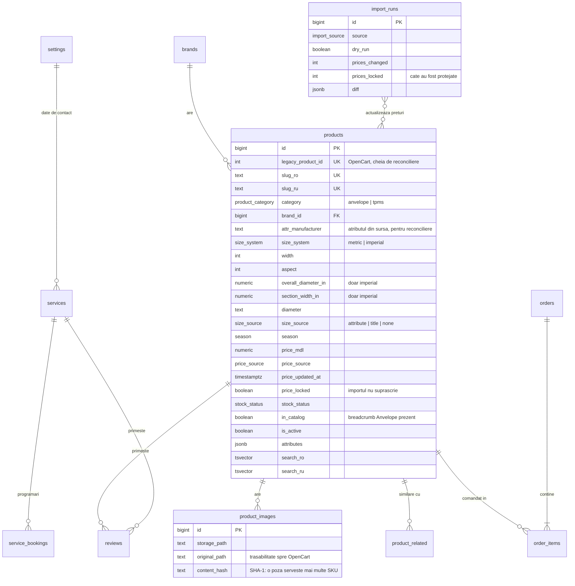

# ARCHITECTURE — anvelope-ungheni.md

Reconstrucția magazinului OpenCart 3.x pe stack modern.
Documentul reflectă **datele reale**, extrase și verificate în Faza 0, nu un catalog ipotetic.

Ultima actualizare: 22 august 2026 · Faza 1

---

## 0. Cifrele care determină arhitectura

| | |
|---|---|
| Produse | **15.010** (15.008 anvelope + 2 senzori TPMS) |
| Disponibile (`supplier`) | **8.066** (54%) |
| Indisponibile (`out_of_stock`) | **6.944** (46%) |
| Branduri | **135** |
| Sezon | vara 7.340 · iarna 5.805 · all season 1.858 · fără 7 |
| Dimensiuni metrice | 14.988 · **imperiale 20** · fără dimensiune 2 (senzorii) |
| Diametre distincte | 19 (R10 … R23, inclusiv variantele C) |
| Produse cu descriere proprie | **8 din 15.010** |
| Produse cu imagine | 15.000 (10 fără) |
| Slug RU diferit de RO | **13.502 (90%)** |
| Relații „produse similare" din sursă | **35.070**, toate rezolvabile |
| Rute de filtru indexate azi | **190** |

Trei consecințe directe:

1. **Aproape jumătate din catalog nu se poate cumpăra.** Starea „indisponibil" nu e un caz marginal — e jumătate din trafic. Vezi §8.
2. **Nu există conținut editorial.** Interfața e singurul conținut. Nu există text în spatele căruia să ascunzi o navigație slabă.
3. **90% din slug-urile RU diferă de RO.** Rutarea bilingvă nu poate fi o transformare de string; se face prin lookup în bază.

---

## 1. Stack

```
Framework     Next.js (App Router, RSC implicit) · TypeScript strict
Styling       TailwindCSS v4 + design tokens ca CSS custom properties
Bază de date  Supabase Postgres + RLS
Căutare       Postgres FTS + pg_trgm (fără Algolia/Meilisearch în v1)
Imagini       Supabase Storage + next/image (AVIF/WebP)
i18n          next-intl — RO la `/`, RU la `/ru`
Formulare     react-hook-form + zod
Email         Resend
Deploy        Vercel
```

Interzise prin decizie: Redux, styled-components, shadcn instalat integral, librării de animație grele.
Mișcare: CSS + View Transitions API. `motion` doar dacă e strict necesar, izolat, client-side.

> **`TODO(cristian)` — abatere de la briefing.** Briefingul cere Next.js 15. `create-next-app` a
> instalat **Next.js 16.3.2**, versiunea curentă. Tot ce e specificat funcționează identic.
> Fixarea pe 15 e o comandă și zero cod de rescris, dar trebuie decisă **acum**, nu după ce
> se scrie UI. Recomandarea mea: rămânem pe 16.

---

## 2. Schema bazei de date

### 2.1 Diagramă



### 2.2 Migrații

`supabase/migrations/`, numerotate, **idempotente**, fiecare cu rollback în `supabase/rollback/`.

| Fișier | Conținut |
|---|---|
| `0001_extensions_and_enums.sql` | `pg_trgm`, `unaccent`, 12 tipuri enumerate, trigger `set_updated_at` |
| `0002_catalog.sql` | `settings`, `brands`, `products`, `product_images`, `product_related` |
| `0003_content.sql` | `services`, `legal_pages`, `reviews`, `service_bookings` |
| `0004_commerce.sql` | `orders`, `order_items`, `import_runs` |
| `0005_search_and_indexes.sql` | `search_ro`/`search_ru`, 42 indexuri, `facet_counts` |
| `0006_rls.sql` | Row Level Security |

**Verificate pe Postgres 17 real**, nu doar scrise: rulate de două ori consecutiv fără eroare
(idempotență), 12 tabele, 42 de indexuri, 4 constrângeri `CHECK` pe `products`.
`node tools/db/apply-local.mjs --twice` reproduce verificarea.

### 2.3 Constrângeri hard, în bază

Baza refuză datele degradate; aplicația nu loghează avertismente pe care nu le citește nimeni.

```sql
check (is_active = false or size_source <> 'none' or category = 'tpms')
check (stock_status = 'out_of_stock' or price_mdl is not null)
check (price_mdl is null or price_mdl > 0)
```

Verificate cu `node tools/db/test-constraints.mjs` — 8 cazuri, toate se comportă corect:
produs activ fără dimensiune → respins, produs în stoc fără preț → respins, preț zero → respins,
produs epuizat fără preț → acceptat.

Excepția `category = 'tpms'` nu e cosmetică: senzorii de presiune n-au dimensiune de anvelopă,
iar regula B.2 i-ar fi dezactivat pe amândoi.

### 2.4 Ce NU are schema

- **Eticheta EU** (consum, aderență, zgomot) — nu există în sursă. Fără date, fără coloane.
- **`tpms_sensors`** ca tabel separat — senzorii sunt produse cu `category = 'tpms'`.
  Un tabel separat ar fi dublat schema pentru două rânduri.
- **Conturi de client** — v1 e guest checkout. `orders` nu are `user_id`.

### 2.5 RLS

| Tabel | Citire publică | Scriere publică |
|---|---|---|
| `products`, `brands`, `product_images`, `product_related`, `services`, `legal_pages`, `settings` | da | nu |
| `reviews` | doar `is_approved = true` | insert cu `is_approved = false` |
| `orders`, `order_items`, `service_bookings` | **nu** | insert |
| `import_runs` | nu | nu |

Confirmarea comenzii se randează server-side, cu service role. Clientul nu poate citi comenzi —
nici pe ale lui, nici pe ale altora.

---

## 3. Harta rutelor

RO fără prefix, RU sub `/ru`. **`/ru-ru` nu există și nu a existat** — nu se generează nicio rută cu acel prefix.

| RO | RU | Sursa slug-ului RU |
|---|---|---|
| `/` | `/ru` | fix |
| `/catalog-anvelope` | `/ru/katalog-shin` | extras din sursă |
| `/senzori-presiune-anvelope` | `/ru/datchiki-davleniya-v-shinah` | extras |
| `/servicii` | `/ru/uslugi` | extras |
| `/{slug-produs-ro}` | `/ru/{slug-produs-ru}` | **din bază**, 90% diferite |
| `/{slug-brand}` | `/ru/{slug-brand}` | identice în ambele limbi |
| `/{slug-serviciu-ro}` | `/ru/{slug-serviciu-ru}` | extras, toate 9 diferite |
| `/contact` `/cos` `/checkout` `/comanda/{nr}` | echivalente RU | de stabilit |
| `/favorite` `/comparare` | | |
| `/termeni-si-conditii` `/livrare-si-plata` `/retur-si-garantie` `/politica-de-confidentialitate` | | |
| `/admin/*` | — | `noindex`, necrawlabil |
| `/design-system` | — | intern, `noindex`, exclus din sitemap |

### 3.1 Rutele de filtru — 190, toate indexate azi

Nu sunt query params, sunt rute. Se păstrează identic.

```
/catalog-anvelope/latime_{135..325}       20 rute
/catalog-anvelope/inaltime_{25..85}       13 rute
/catalog-anvelope/diametru_{r10..r23}     19 rute
/catalog-anvelope/sezon_{vara|iarna|all-season}   3 rute
/catalog-anvelope/marca_{brand}          134 rute
/catalog-anvelope/nalichie                 1 rută
```

Cele 9 servicii, cu slug-urile RU reale extrase din sursă:

```
/schimbul-rotilor                      ->  /ru/zamena-koles
/reparatia-discurilor                  ->  /ru/rihtovka-diskov
/reparatia-anvelopelor                 ->  /ru/remont-shin
/balansarea-rotilor                    ->  /ru/balansirovka-kolyos
/sudura-cu-argon                       ->  /ru/argonnaya-svarka
/vopsirea-discurilor                   ->  /ru/pokraska-diskov
/slefuirea-discurilor-de-frana         ->  /ru/protochka-tormoznyh-diskov
/hotel-anvelope                        ->  /ru/hranenie-shin
/incarcare-conditionere-auto-cu-freon  ->  /ru/zapravka-avtokondicionera
```

### 3.2 Resolver de rută rădăcină

Produsele, brandurile și serviciile stau toate pe rădăcină. Ordinea de rezolvare:

```
1. rută statică (listă închisă, verificată la build)
2. serviciu
3. brand
4. produs
5. 404
```

`route-map` generat **la build**, nu la runtime: `Map<slug, { type, id }>`, câte unul per limbă.
Un `Map` de 15.300 de intrări costă sub 1 MB și elimină un query la fiecare cerere.

**Test de CI care eșuează la orice coliziune nouă** — `tools/route-map/check-collisions.ts`.
Rulează la build și la fiecare import de produse. Un import care ar introduce un produs
cu slug-ul `contact` trebuie să pice, nu să suprascrie pagina de contact.

Rezultatul testului pe datele actuale se raportează în `data/raw/REPORT.md` §8, separat pentru RO și RU.

---

## 4. Redirects

`lib/redirects.ts`, generat din date, nu scris de mână. Acoperă:

| Categorie | Regulă |
|---|---|
| `index.php?route=product/product&product_id=N` | → `/{slug_ro}` prin `legacy_product_id` |
| `index.php?route=product/category&path=N` | → categoria echivalentă |
| `index.php?route=information/contact` | → `/contact` |
| `/ru-ru/*` | → `/ru/*` (rută inexistentă istoric, dar apare în briefing și posibil în linkuri externe) |
| paginare veche `?page=N&limit=M` | → query params noi |
| trailing slash, `www.` | → canonic |
| slug schimbat | ideal zero; orice apariție se generează din date |

`tools/verify-redirects.mjs` ia **toate cele 15.010+ URL-uri vechi** (produse, branduri, servicii,
categorii, cele 190 de rute de filtru, ambele limbi) și verifică pe staging că fiecare întoarce
`200` sau `301` către un `200`. **Zero `404` la lansare** e o condiție de lansare, nu un obiectiv.

---

## 5. Strategia de indexare a filtrelor

20 lățimi × 13 înălțimi × 19 diametre × 3 sezoane × 134 branduri = milioane de combinații.
Se indexează doar ce aduce trafic real.

**Indexabile** (`index, follow`, incluse în `sitemap.xml`, canonical către ele însele):

| Tip | Exemplu | Nr. |
|---|---|---|
| dimensiune completă | `/catalog-anvelope/205-55-r16` | ~450 reale |
| sezon | `/catalog-anvelope/sezon_iarna` | 3 |
| brand | `/catalog-anvelope/marca_michelin` | 134 |
| brand + sezon | `/catalog-anvelope/marca_michelin/sezon_iarna` | ~300 cu produse |
| dimensiune + sezon | `/catalog-anvelope/205-55-r16/sezon_iarna` | ~900 |
| filtrele simple existente | lățime, înălțime, diametru, disponibilitate | 53 |

**Neindexabile** (`noindex, follow`, excluse din sitemap):
orice altă combinație de filtre, toate sortările, paginile 2+.

**Canonical:** paginile 2+ au canonical către **ele însele**, nu către pagina 1 — altfel Google
nu descoperă produsele de pe pagina 40. `rel=prev/next` nu mai e folosit de Google, dar
paginarea rămâne accesibilă prin linkuri reale, nu doar prin JavaScript.

O rută de filtru **fără niciun produs disponibil** primește `noindex` automat.
Nu ținem în index 400 de pagini goale.

---

## 6. Căutarea

Trei moduri de intrare, detaliate în promptul Fazei 3. Ce ține de arhitectură:

- `search_ro` / `search_ru` — coloane `tsvector` generate, cu index GIN.
  Configurația e `'simple'`, nu `'romanian'`/`'russian'`: titlurile sunt nume proprii și cifre,
  iar stemming-ul ar transforma „Primacy" în „primaci".
- `pg_trgm` pe `products.title_ro` și `brands.name` pentru autocomplete tolerant la greșeli.
- **Contoarele de facete se citesc din vederea materializată `facet_counts`**, nu prin
  `COUNT(*)` pe 15.010 rânduri la fiecare tastă. Se reîmprospătează după fiecare import.
- **Paginare keyset**, nu `OFFSET`: index pe `(price_mdl nulls last, id)`.
  Pagina 400 costă cât pagina 1.

---

## 7. Imaginile

**Descoperire din Faza 0:** deduplicarea pe SHA-1 elimină circa **80%** din fișiere.
Furnizorul dă fiecărui SKU un nume de fișier propriu, dar fotografia din spate e aceeași —
o poză per **model** de anvelopă, nu per dimensiune. 15.000 de referințe se reduc
la câteva mii de fișiere reale.

Consecințe:

- `product_images.content_hash` (SHA-1) e cheia de deduplicare. Mai multe produse
  pot referi același `storage_path`.
- Patru directoare sursă se normalizează într-o schemă unică, cu numele **slugificat**
  (unul dintre ele conține un spațiu în cale):
  `catalog/product/` · `catalog/pics/` · `catalog/produse noi/` · `catalog/111/1111/`
- `original_path` se păstrează pentru trasabilitate.
- Dimensiunea din numele fișierului **nu e sursă de adevăr** — fotografiile sunt per model.

> **`TODO(cristian)` — buget de stocare.** Originalele au ~420 KB bucata. Chiar și după
> deduplicare, depășesc 1 GB — limita planului gratuit Supabase Storage.
> Recomandare: în Storage urcăm derivate AVIF/WebP la maximum 1200px (sub 100 KB fiecare),
> iar originalele rămân arhivate local. Trebuie decis înainte de seed.

---

## 8. Regimul produselor indisponibile

**6.944 de produse, 46% din catalog.** Nu e un caz marginal, e jumătate din site.

### Catalog
- Filtrul implicit **exclude** `out_of_stock`.
- Toggle vizibil, nu îngropat în drawer: „Arată și produsele momentan indisponibile", cu contorul lor.
- Intră în numărătorile de facete **doar** când toggle-ul e activ.

### Pagina de produs
- URL-ul rămâne **`200`**. Niciodată `404`, niciodată redirect. Sunt pagini cu istoric în index.
- În loc de preț: **„Preț la cerere"** + CTA telefon proeminent.
  Fără „0 MDL", fără preț barat inventat, fără semne de exclamare.
- Butonul „Adaugă în coș" **absent**, nu dezactivat.
- **Alternative reale** ca element principal al paginii: aceeași dimensiune exactă, disponibile,
  sortate după preț. Fără potriviri exacte → același diametru, ±10 lățime, ±5 înălțime,
  marcate explicit „dimensiune apropiată".

### SEO
- `noindex, follow` · `schema.org` `availability: OutOfStock`
- Excluse din `sitemap.xml`
- **Excluse din calculele „de la X MDL"** de pe paginile de brand și dimensiune.
  Un „de la 427 MDL" bazat pe un produs indisponibil e o minciună.

### Admin
Vizibile, filtrabile, coloană dedicată. Când feed-ul le reactivează cu preț, revin automat în circuit —
nicio intervenție manuală.

---

## 9. Ciclul de viață al prețului

Cine poate scrie prețul, în ce ordine de precedență:

```
1. price_locked = true   ->  NIMENI nu suprascrie automat.
                             Doar o editare manuală explicită din admin schimbă valoarea.
2. admin_edit            ->  setează automat price_locked = true
3. scheduled_feed / api_sync / manual_csv
                         ->  scriu doar dacă price_locked = false
4. legacy_import         ->  o singură dată, la migrare
```

Fiecare scriere actualizează `price_source` și `price_updated_at`. Pentru orice produs se poate
răspunde, oricând, la „de unde vine prețul ăsta și când a fost atins ultima oară".

Fiecare rulare de import scrie un rând în `import_runs`: sursă, actor, dry-run, rânduri
create/actualizate/sărite/dezactivate, **câte prețuri au fost protejate de `price_locked`**, diff serializat.

Detaliul cu `price_locked` nu e opțional. Fără el, o corecție manuală de preț e călcată
de următorul import, fără urmă, și sistemul devine activ dăunător.

---

## 10. Ce se întâmplă când feed-ul șterge un produs

**Recomandare: niciodată `DELETE`.**

Un produs care dispare din import primește:

```
is_active     = false
stock_status  = 'out_of_stock'
price_mdl     -> se păstrează ultima valoare cunoscută, dar nu se mai afișează
```

URL-ul rămâne **`200`** cu `noindex`, iar pagina arată alternativele din §8.

Argumentul, în ordinea importanței:

1. **SEO.** 15.010 URL-uri indexate. Ștergerea a 2.000 dintre ele înseamnă 2.000 de `404`
   și pierderea autorității acumulate. Recuperarea durează luni.
2. **Reversibilitate.** Feed-urile de distribuitor sar. Un produs absent azi poate reapărea
   mâine. Cu `is_active = false` revine automat; cu `DELETE` se pierde `legacy_product_id`,
   istoricul de preț și relațiile de produse similare.
3. **Integritatea comenzilor.** `order_items` referă `products(id)`. Un `DELETE` ar rupe
   istoricul comenzilor — de aceea `order_items` păstrează și instantanee (`title_snapshot`,
   `price_snapshot`), dar tot nu e un motiv să ștergem.
4. **Depanare.** Un import greșit care „șterge" 8.000 de produse se anulează cu un `UPDATE`
   dacă am dezactivat, și cu un restore din backup dacă am șters.

Ștergerea fizică rămâne o operație manuală de admin, pentru cazuri punctuale, cu confirmare.

---

## 11. Actualizarea recurentă a prețurilor și stocurilor

*Scris în Faza 0 ca „nu se proiectează încă". Rezolvat pe 5 septembrie 2026; textul de
mai jos descrie ce rulează, nu ce se propune.*

Sursa e **pandashop.md**, aceeași din care fusese alimentat și site-ul OpenCart. Nu există
feed; se citește structura pe care o publică ei singuri (`application/ld+json` de tip
Product pe fiecare fișă, plus tabelul de caracteristici). Contractul de sursă e izolat în
`tools/sync/pandashop/source.mjs`, deci ziua în care apare un feed real schimbă o linie
în `config.mjs`, nu pipeline-ul.

### 11.1 Cele patru porți

| | Ce face | Când |
|---|---|---|
| **A** `baseline.mjs` | Fotografiază ID-urile lor în `pandashop_seen`. Nu importă nimic. | o singură dată |
| **B** `import.mjs` | Importă ID-urile apărute DUPĂ fotografie. | cron, zilnic 5:00 |
| **C** `refresh.mjs` | Confruntă prețul și stocul celor ~15.000 ale noastre cu listarea lor. | cron, zilnic 3:00 |
| **D** `backfill.mjs` | Importă ce au ei pe stoc și n-am avut niciodată. | manual, la nevoie |

Gate C și D au fost adăugate pentru că A+B, singure, produceau o eroare tăcută și gravă:
fotografia inițială marcase toate cele 25.440 de ID-uri drept „văzute", deci *„produs nou"*
însemna doar *„ID apărut după fotografie"*. Consecințele, măsurate:

- **6.944 de produse** rămăseseră pe `out_of_stock` cu preț `NULL` de la exportul din
  OpenCart, iar catalogul le ascunde (§8). 1.239 dintre ele erau pe stoc la pandashop chiar
  în ziua în care s-a măsurat.
- **1.207 anvelope** pe care ei le au pe stoc nu existau deloc la noi și nu puteau intra
  niciodată prin Gate B.

### 11.2 Ce poate scrie sincronizarea

`db-write.mjs` are o listă albă de tabele și refuză `update` pe `products`. Rămâne așa.
Singura cale prin care un produs existent poate fi modificat e funcția
`sync_refresh_products(jsonb)` (migrarea 0020), care atinge **exclusiv**:

```
pandashop_id · source_price_mdl · price_mdl · price_source · price_updated_at
stock_status · synced_at
```

Titlul, slug-ul, dimensiunea, descrierea, imaginile și `is_active` sunt în afara razei ei de
acțiune. `price_locked` e respectat în corpul funcției, nu în apelant: un preț pus cu mâna
primește stocul și `source_price_mdl`, dar cifra afișată rămâne a omului.

### 11.3 Potrivirea

`match.mjs`, un singur modul, folosit de toate porțile — două definiții ale potrivirii ar
diverge, iar când diverg rezultatul e un duplicat în catalog sau un preț pe produsul greșit.

Cheia naturală e `brand · model · lățime · profil · diametru · sarcină · viteză · XL ·
runflat · omologare`. Ultimul câmp a fost adăugat în septembrie: marcajul de fabrică („MO",
„AO", „N0", „*") stă la noi lipit de model și la ei după indici, deci aceeași anvelopă avea
două chei. 254 de fișe erau afectate.

Se caută sub **două chei** pentru fiecare rând de-al nostru — cea din coloanele structurate
și cea din titlu — pentru că 1.896 de fișe au titlul în dezacord cu coloanele, moștenire din
atributele OpenCart. A treia trecere, relaxată, prinde fișele cărora le lipsesc indicii, dar
numai când există un singur candidat și XL/runflat coincid. Când nu se știe, nu se ghicește:
produsul rămâne nepotrivit și apare în raport.

### 11.4 Prețul

Măsurat pe 5.799 de perechi comparabile: mediana raportului preț-nostru / preț-pandashop e
**1.000**, iar 3.264 de produse aveau prețul identic. Catalogul vindea 1:1 cu sursa.
`settings.pricing_rules` avea totuși `default_margin_pct: 15`, valoare implicită nevalidată
niciodată pe date; aplicată, ar fi ridicat ~5.800 de prețuri cu 15% peste ce afișează
pandashop public. S-a pus pe `0` cu rotunjire `none`, adică exact comportamentul de până
atunci. Marja se schimbă din admin, fără deploy.

### 11.5 Întrerupătoarele

Toate opresc rularea **fără să scrie**, nu o continuă cu avertisment:

- enumerare sub 90% din totalul pe care îl declară ei — listare ciuntită;
- peste 95% din catalog ar fi modificat de o singură rulare `refresh`;
- peste 100 de produse noi într-o rulare `import`;
- peste 30% carantină la import;
- un lot de `backfill` cu peste 80% fișe neaduse — sursa e căzută, se oprește acolo unde a
  ajuns, iar ce s-a scris rămâne scris.

Ultimul a fost adăugat după ce pandashop a început să răspundă `500` pe tot catalogul în
mijlocul primei recuperări.

---

## 12. Decizii deschise

| # | Decizie | Blochează | Recomandarea mea |
|---|---|---|---|
| 1 | **Next.js 16 vs. 15** | scrierea de UI | rămânem pe 16 |
| 2 | **Eticheta stocului disponibil** | pagina de produs | vezi mai jos |
| 3 | **Derivate AVIF în Storage vs. originale** | seed-ul | derivate ≤1200px |
| 4 | **Programul de duminică** | lansarea | — |
| 5 | **Răspunsurile despre feed** | Faza 5 | — |
| 6 | **Slug-urile RU pentru rutele noi** (`/cos`, `/checkout`, paginile legale) | i18n | le propun eu, le confirmi |
| 7 | **Domeniu de staging + acces Search Console** | Faza 7 | — |

### Decizia 2, în detaliu

Briefingul spunea că există două stări de stoc: „În stoc" și „Stoc furnizor".
Scanarea tuturor celor 15.010 pagini arată altceva — **eticheta „În stoc" nu există nicăieri**:

```
8.066  „Stoc furnizor"    (are preț, buton de coș activ)
6.915  „Stoc epuizat"
   29  etichetă goală, dar cu clasa CSS `qty-not-in-stock`
```

Filtrul „In stoc" al site-ului vechi numără 8.060 — adică exact produsele etichetate
„Stoc furnizor". Cu alte cuvinte, magazinul le tratează ca disponibile, dar le eticheta
ca fiind la furnizor.

Mapare aplicată acum, fidelă sursei: `Stoc furnizor` → `supplier`, restul → `out_of_stock`.
Enum-ul păstrează și `in_stock` pentru viitor, dar **nu e populat de niciun produs**.

**Întrebarea pentru tine:** pe site-ul nou, cele 8.066 de produse disponibile se afișează
ca „În stoc" sau ca „Stoc furnizor"? Diferența e comercială, nu tehnică — „Stoc furnizor"
e mai onest dacă marfa vine în 2–3 zile, „În stoc" convertește mai bine dacă e pe raft.
Nu decid eu asta.
